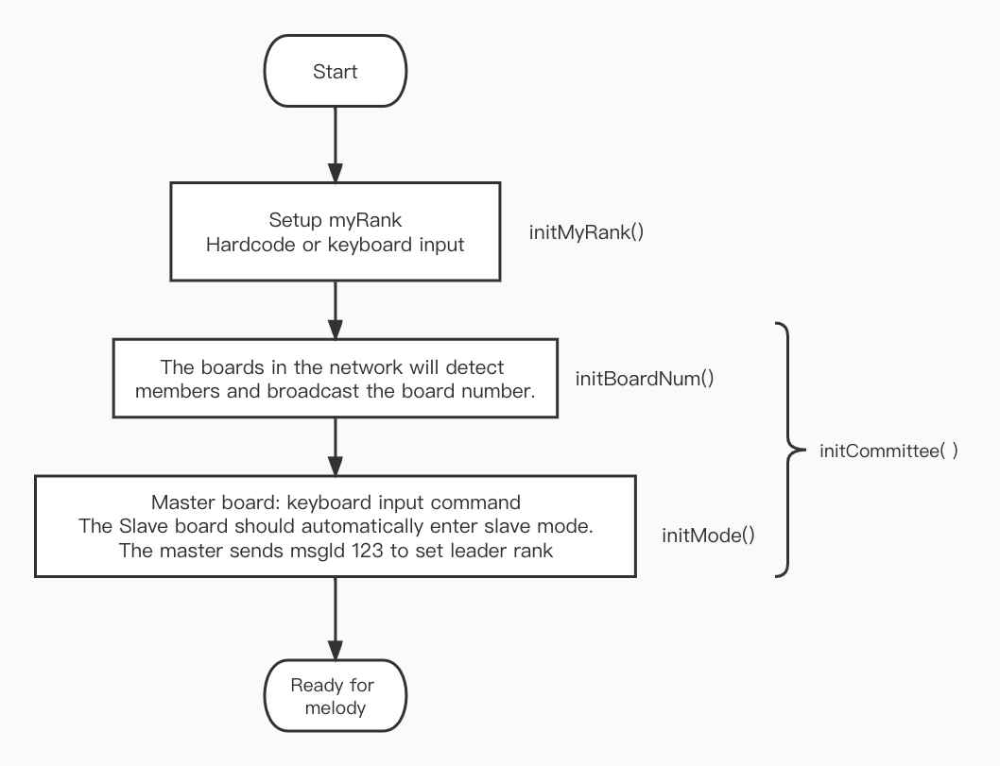
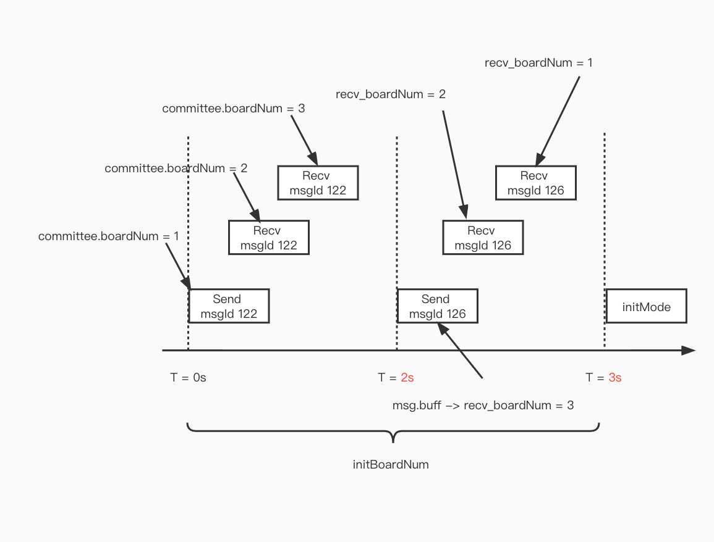
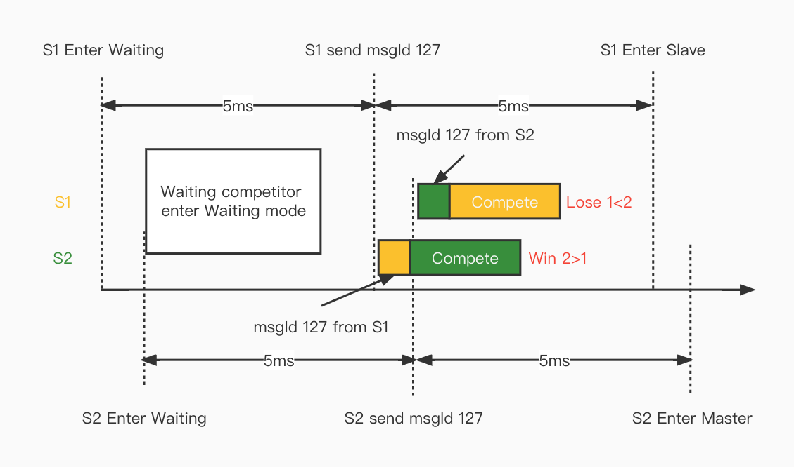
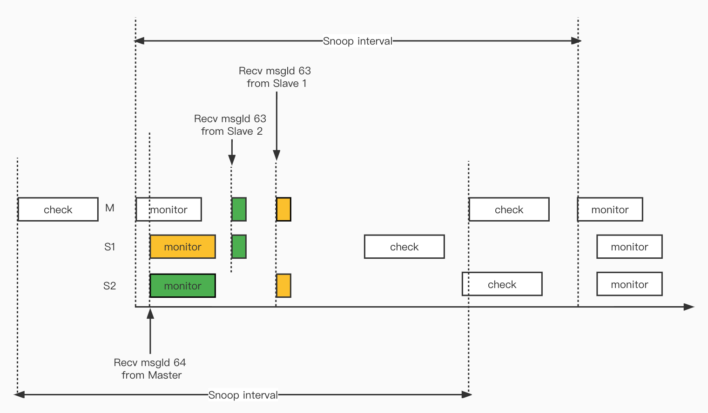
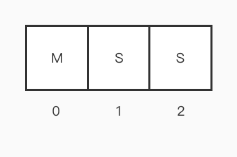
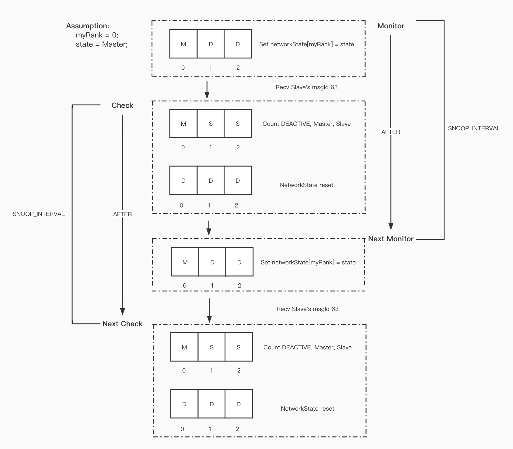

# EDA423 Real-time Music Player

## The basic idea
This music player is based on the implementation of the EDA223 project, the main goal is to add the CAN network communication protocol to the original project, to achieve a reliable boards network. All the boards connected to the network can play music in a round robin way, and can exchange leadership between the boards (The committee). The network can also detect The network can also detect the loss of members, which is divided into Master Failure and Slave Failure (The watchdog).

## The protocol

| msgId   | msg.nodeId | msg.buff                | Usage                                | State           | Class       |
| ------- | ---------- | ----------------------- | ------------------------------------ | --------------- | ----------- |
| 1       | myRank     | NaN                     | Increase the volum                   | Master          | Melody      |
| 2       | myRank     | NaN                     | Decrease the volum                   | Master          | Melody      |
| 3       | myRank     | NaN                     | Mute the melody                      | Master          | Melody      |
| 4       | myRank     | NaN                     | Pause the melody                     | Master          | Melody      |
| 5       | myRank     | New value, size = 1     | Change the positive key              | Master          | Melody      |
| 6       | myRank     | New value, size = 1     | Change the negative key              | Master          | Melody      |
| 7       | myRank     | New value, size = 3     | Change the bpm                       | Master          | Melody      |
| 8       | myRank     | NaN                     | Reset the key and tempo              | Master          | Melody      |
| 119     | myRank     | Note ID                 | Boardcast current note               | Master          | Network     |
| 122     | myRank     | NaN                     | Detect member in the network         | Init            | Network     |
| 123     | myRank     | NaN                     | Declare Leadership                   | Waiting->Master | Network     |
| ~~124~~ | ~~myRank~~ | ~~Rank from msgId 127~~ | ~~Response to leader claim~~         | ~~Init~~        | ~~Network~~ |
| 125     | myRank     | NaN                     | Reset the bpm and key                | Master          | Network     |
| 126     | myRank     | boardNum                | Send board number in current network | Init            | Network     |
| 127     | myRank     | NaN                     | Claim for leadership                 | Init->Waiting   | Network     |

## Establish the network
The network is built based on the following processes.

The functions related to Master and Slave state switching are implemented in an object called *Committee*, which will be used to maintain a state machine that is used to handle four possible scenarios in the current network: Network Leadership Initialization, Network Leadership Exchange, Master Failure, and Slave Failure.

### initMyRank
In this step, we manually assign an Id to each board, either hard-coded in the code or entered via the keyboard.

### initBoardNum
In this step we need to create a method called initBoardNum, in which we will send some CAN messages according to a certain time convention and count the number of specific signals received over a period of time to determine the number of boards in the network.

We can see that between T=0s and T=2s we send a msgId 122 and receive several msgId 122. we specify that at T=0s we send a msgId 122 and initialize committee.boardNum with a value of 1. for each msgId 122 received until T=2s we add the boardNum by 1 for each msgId 122 received until T=2s.

At T=2s is when we send msgId 126 and load the boardNum of the current board in msg.buff. The meaning here is to send the information about the number of boards in the network received by the current board to the members of the current network. Then we can see that in the following 1s we receive some msgId 126, and in the msg.buff of these messages we can get the number of members observed by other boards, and we take the largest of these values (including our own boardNum). The point here is that we know that the network members cannot join the network at the same time, but in sequence. Therefore we use the number observed by the first board to join the network as the number of our network members.

After T=3s we agree that the process of detect is finished and the messages related to msgId 122 and msgId 126 are no longer processed.

Here we also need to add a lock to avoid that after T=2s we still receive the msgId 122 message and generate a response to it. But this problem may not be very significant in this project because we have a small number of boards, at most three, and just need to pay attention to the operation at startup time.

### initMode

In this step we start initializing the state machine. 

First all boards should have an initial state of **Init**, which means a new member of the network (or a Master waiting to hand over leadership).

Then the one who wants to be the Master press 'o' enter competition, after total 10ms it will become Master.

All boards in the Init state will enter the **Slave** state after receiving msgId 123.

At this point this network is ready.

Boards in the Slave state can also compete for leadership by pressing 'o'. The **Master** will enter **Slave** state after receiving msgId 123.

### Compete

Then use the button 'o' to compete for leadership, which of course needs to be assigned manually here. After we press 'o' the board will enter the **Waiting** state, use AFTER(MSEC(5), checkWaiting) to check if there are other boards in the **Waiting** state. If there are other boards in the **Waiting** state, then a compete is triggered and we specify that the nodeId with the greater Rank wins the race. The first 5ms here is to waiting another competitor join the race, after 5ms we treat this competitor is not in current race.

Since there are and only two boards that may compete in this system, the current state machine cannot handle competition situations with more than two boards.

If a board in the **Waiting** state fails to compete, then it returns to the **Slave** state and conversely broadcasts msgId 123 declaring its leadership (no other competitor can exist) and then go into **Master** state.

## Melody playing

### Notes broadcast
After finishing the network leadership setup, we are going to start playing music. The notes are broadcast via msgId 119 and each board needs to determine if the note needs to be played based on the current Notes ID. 

There are different judgment conditions for different boardNum.

boardNum == 3: noteId % 3 == myRank, the current board plays this note.

boardNum == 2: noteId % 2 == 0 Master play, noteId % 2 == 1 Slave play. (Current network can only exist one Master and one Slave)

boardNum == 1: Always current board play.

### Operation broadcast
In this melody player, we have several operaitons to control the volume, bpm and key of the music. Each operation has its own CAN message to broadcast from Master to Slave.

### Master and Slave behavior
For the Master, it will first send a msgId 119 in the function that plays each note, broadcasting the current note that should be played to the network. Then the note is played and the play function is executed according to the bpm.

For the Slave, every msgId 119 received will trigger the CAN message handler and a function will handle whether to play the note or not. Note that the Slave does not need to control the period of the sent notes, because msgId 119 is already sent according to the bpm.

## Failure handling
### Defination of Failure Mode
*Failure Mode F1*: The user manually enters SILENCE FAILURE and manually exits. In this mode the board can actively send a CAN message to inform the network members that a failure has occurred.

*Failure Mode F2*: The user manually enters silence failure and automatically recovers after 10-30 seconds. In this mode the board can actively send a CAN message to inform the network members that a failure has occurred.

*Failure Mode F3*: The CAN connection wire is disconnected and resumed when the connection wire is plugged back in. No CAN message can be send.

### The Watchdog (Test passed on 2 boards)
A watchdog is an object used to monitor the status of boards in a network. The basic operation logic of the watchdog is shown in the figure.

### Monitor 

Monitor is a function that maintains the networkState array, which stores the current state of all boards in the network: Master/Slave/F_1/F_2/F_3/Deactive, where Deactive is a Watchdog transient that does not exist in the committee. You will also notice that we have added three new states F_1/F_2/F_3 to the committee, which correspond to the three possible failures of the board.

~~The Monitor first sets all boards to Deactive (i.e. assuming none of them are alive) and sets networkState[myRank] to committee->mode (i.e. our own state). Then send msgId 63, since all boards in the network have the same behavior, we will also receive msgId 63 from other boards (if they are alive), and then we modify the corresponding networkState[msg.nodeId] in the CAN handler of the watchdog.~~

~~Finally we use the AFTER function to call the check function after [SNOOP_INTERVAL] to check if there is a Deactive board in the current network and set it to F_3 (F_1/F_2 are both active entries).~~

The monitor first set **networkState[myRank] = myMode**, then sends the corresponding CAN message according to its status, finally only the Master's Monitor runs with a [SNOOP_INTERVAL] cycle. *For Slave, their monitor will **start** after receiving msgId 64 from the Master*, which means that all Slave no longer start the monitor function autonomously. Once the current state of the board changes from Master to another state, then Monitor's period execution will stop.

**Change Log**: During the test, we found that the original check start monitor may not be synchronized with the watchdog of Master and Slave in the reality. Due to the lack of information about the Master, the Slave starts to compete to become the Master at a certain point in time, resulting in the existence of two Masters in the network.

As we had wipe all the states which is stored in networkState at the end of Check, we need to track all boards in every watch snoop. As we can know from the assignment, F1 and F2 mode could still handle the CAN message, which means it still send and response watchdog message. Therefore, in different states, watchdog will send different msgId, as shown in the following table.

| msgId | msg.nodeId | msg.buff | Usage                                       | State     | Class    |
| ----- | ---------- | -------- | ------------------------------------------- | --------- | -------- |
| 61    | myRank     | NaN      | Failure F1 occure                           | F_1       | Watchdog |
| 62    | myRank     | NaN      | Failure F2 occure                           | F_2       | Watchdog |
| 63    | myRank     | NaN      | Slave monitor the network/Failure F3 occure | Slave/F_3 | Watchdog |
| 64    | myRank     | NaN      | Master monitor the network                  | Master    | Watchdog |

We can find that Slave and F_3 share the same msgId 63 signal.This is because we believe that if a board is in the F_3 state, its watchdog should continue to work, i.e. send messages according to the snoop interval, and we know that when a new board is added to the network, it must be a Slave. (If there is only this one board, it will be compete and thus transformed into Master). 

Then we keep sending msgId 63 at F_3, and when we rejoin the network, we will immediately receive msgId 63 from other Slave or msgId 64 from Master, and these CAN messages will make our board in the networkState corresponding to the board state. In the check function we will find that we are currently out of the F_3 state and in the Slave state. 

Similarly, other boards receive the msgId 63 from us and they will modify the state in their networkState to know that we have recovered from the F_3 failure.

F_1/F_2 will also sends msgId 61 and msgId 62 through the monitor, which ensures that we have the latest status of the boards in the network at any given time (the status is updated at every Monitor-Check cycle).

The difference between F_1 and F_2 is only between manual recovery and automatic recovery, the recovery process they perform is exactly the same. Please refer to the New member join section for the specific recovery process.

### Check
We start iterate through the networkState array first, counting the number of DEACTIVE, Master and Slave in the network.

The number of DEACTIVE may indicates the CAN cable of current board is pluged out or not. When we detect 2 DEACTIVE, means we don't get response from other boards, the CAN cable may be lost in this case, thus we should enter failure F_3. (Not in loopback mode. The F_3 failure in loopback mode is different from none-loopback mode.)

Whenever we find a Master or Slave, we increase the number of boardNum by 1. At the end of the traversal, we set the new number of boards using setBoardNum.

Then we need to keep an eye on the number of Masters. When the number of Masters is greater than 1, two Masters need to COMPETE. This can happen when: we move the Master out of the network, at this point the Master detects two DEACTIVE, but since we are the Master, we should continue to play. The two remaining Slave will COMPETE to produce a new Master and form a Master-Slave network. When the original Master joins this MasterSlave network, there will be two Masters.

After dealing with the multiple Master case again, we need to focus on how to recover from the F_3 failure.

As mentioned earlier, when we are in F_3 failure and have access to the network at this time, it will be detected by other boards in the next watchdog monitor and the networkState of the current board will be changed. When the networkState changes, it will also change the boardNum, so we use the boardNum as a flag to determine the exit from F_3 failure. When our detected boardNum is greater than 0, we will exit from F_3 and enter Slave.

Finally we have to determine if there is a Master in the network and if MasterNum == 0, then we trigger the compete.

### Passive backup for failure
For failures to occur, we need to use passive backup to ensure that every note will be played. After the Master detects or receives a failure occurrence, it will replay the current note with noteId-1 in Melody, i.e. the next note.

This depends on the implementation of the respective code, in our code we switch to the next note as soon as the Master broadcasts the current note, which means that for our Master, the note it gets at any given moment must be the one that hasn't been played yet. So when we send the previous note, if it is not played, we need to resend the previous note, so we need noteId-1.

On the contrary, if we add +1 to the noteId in the code and then send the note, the noteId obtained by the Master at any given moment must be the currently playing note, so we can repeat the noteId.

You are free to choose the implementation here.

### New member join

**Related CAN messages**

| msgId | msg.nodeId | msg.buff | Usage                | State                | Class    |
| ----- | ---------- | -------- | -------------------- | -------------------- | -------- |
| 59    | myRank     | boardNum | Failure recovery_ack | Master               | Watchdog |
| 60    | myRank     | NaN      | Failure recovery     | Failure F1/F2->Slave | Watchdog |

**Recovery from F_1 and F_2**

This part mainly focus on failure recovery. When a board is recovery from F_1/F_2, it should send msgId 60. If current network has a Master, it should send msgId 59 to ack and the msg.buff should contain the boardNum in current network.

*Case 1 (with Master)*

| State   | Action                                               | networkState            |
| ------- | ---------------------------------------------------- | ----------------------- |
| F_1/F_2 | Enter recovery, Send msgId 60/ Recv msgId 63 or 64   | \| F_1/F_2 \| S \| M \| |
| Slave   | if Master exist, Recv Ack(msgId 59), update boardNum | \| F_1/F_2 \| S \| M \| |
| Slave   | Check master existence.                              | \| F_1/F_2 \| S \| M \| |
| Slave   | Next monitor, change netWorkState.                   | \| S \| D \| D \|       |
| Slave   | Next check, change netWorkState.                     | \| S \| S \| M \|       |

If the current board is the first board in the network, then it will not receive an ACK from the Master (msgId 59). We stipulate: after sending msgId 60, use AFTER(MSEC(100)) to call a function that checks for the presence of a Master. If no Master exists, we use the COMPETE function to obtain leadership. 

*Case 2  (without Master)*

| State   | Action                                             | networkState                                |
| ------- | -------------------------------------------------- | ------------------------------------------- |
| F_1/F_2 | Enter recovery, Send msgId 60/ Recv msgId 61 or 62 | \| F_1/F_2 \| F_1/F_2/F_3 \| F_1/F_2/F_3 \| |
| Slave   | Check master existence.                            | \| F_1/F_2 \| F_1/F_2/F_3 \| F_1/F_2/F_3 \| |
| Slave   | Change to Master.                                  | \| M \| F_1/F_2/F_3 \| F_1/F_2/F_3 \|       |
| Master  | Get leadership.                                    | \| M\| F_1/F_2/F_3 \| F_1/F_2/F_3 \|        |
| Master  | Next monitor, change netWorkState.                 | \| M \| D \| D \|                           |
| Master  | Next check, change netWorkState.                   | \| M \| F_1/F_2/F_3 \| F_1/F_2/F_3 \|       |

*Note*: Start playing music after we have obtained leadership, otherwise an error will occur.

**Recovery from F_3**

The main evidence for determining to exit F_3 is that the current board is in the F_3 mode and boardNum > 0 (indicating that we have received a CAN message).

F_3 join to the network have two senarios.

*Case 1  (with Master)*

| State | Action                             | networkState        |
| ----- | ---------------------------------- | ------------------- |
| F_3   | Send msgId 63/ Recv msgId 63 or 64 | \| F_3 \| S \| M \| |
| F_3   | Count boardNum = 2                 | \| F_3 \| S \| M \| |
| Slave | Exit F_3, enter Slave              | \| S \| S \| M \|   |

*Case 2  (without Master)*

| State  | Action                             | networkState            |
| ------ | ---------------------------------- | ----------------------- |
| F_3    | Send msgId 63/ Recv msgId 61 or 62 | \| F_3 \| F_2 \| F_1 \| |
| F_3    | Set networkState[myRank] = Slave   | \| S \| F_2 \| F_1 \|   |
| F_3    | Count boardNum = 1                 | \| S \| F_2 \| F_1 \|   |
| Slave  | Exit F_3, enter Slave              | \| S \| F_2 \| F_1 \|   |
| Slave  | Check master existence.            | \|S \|F_2 \|F_1 \|      |
| Slave  | Change to Master.                  | \|M \|F_2 \|F_1 \|      |
| Master | Get leadership, play music.        | \|M \|F_2 \|F_1 \|      |

**Join from Init**

Since this scenario are not required by the Lab-PM, we do not have handler for it.

