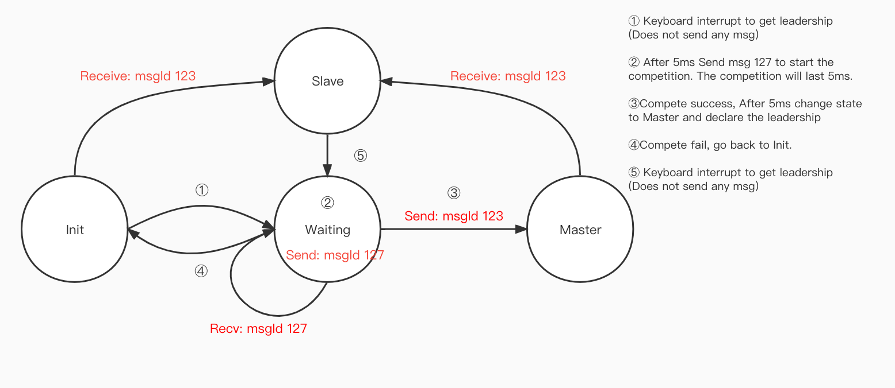

# EDA423 Real-time Music Player

## The basic idea
This music player is based on the implementation of the EDA223 project, the main goal is to add the CAN network communication protocol to the original project, to achieve a reliable boards network. All the boards connected to the network can play music in a round robin way, and can exchange leadership between the boards (The committee). The network can also detect The network can also detect the loss of members, which is divided into Master Failure and Slave Failure (The watchdog).

## The protocol

| msgId      | msg.nodeId | msg.buff | Usage | State | Class |
| ----------- | ----------- | ----------- | ----------- | ----------- | ----------- |
| 1 | myRank | NaN | Increase the volum | Master | Melody |
| 2 | myRank | NaN | Decrease the volum | Master | Melody |
| 3 | myRank | NaN | Mute the melody | Master | Melody |
| 4 | myRank | NaN | Pause the melody | Master | Melody |
| 5 | myRank | New value, size = 1 | Change the positive key | Master | Melody |
| 6 | myRank | New value, size = 1 | Change the negative key | Master | Melody |
| 7 | myRank | New value, size = 3 | Change the bpm | Master | Melody |
| 8 | myRank | NaN | Reset the key and tempo | Master | Melody |
| 9 | myRank | Note ID | Boardcast current note | Master | Melody |
| 60 | myRank | NaN | Failure recovery | Failure->Slave | Watchdog |
| 61 | myRank | NaN | Failure F2 occure | Master/Slave | Watchdog |
| 62 | myRank | NaN | Failure F1 occure | Master/Slave | Watchdog |
| 63 | myRank | NaN |  monitor the network | Master/Slave | Watchdog |
| 122 | myRank | NaN | Detect member in the network | Init | Network |
| 123 | myRank | NaN | Declare Leadership | Waiting->Master | Network |
| 124 | myRank | Rank from msgId 127 | Response to leader claim | Init | Network |
| 125 | myRank | NaN | Reset the bpm and key | Master | Network |
| 126 | myRank | boardNum | Send board number in current network | Init | Network |
| 127 | myRank | NaN | Claim for leadership | Init->Waiting | Network |

## Establish the network
The network is built based on the following processes.

The functions related to Master and Slave state switching are implemented in an object called *Committee*, which will be used to maintain a state machine that is used to handle four possible scenarios in the current network: Network Leadership Initialization, Network Leadership Exchange, Master Failure, and Slave Failure.

<!--  -->

### initMyRank
In this step, we manually assign an Id to each board, either hard-coded in the code or entered via the keyboard.

### initBoardNum
In this step we need to create a method called initBoardNum, in which we will send some CAN messages according to a certain time convention and count the number of specific signals received over a period of time to determine the number of boards in the network.

We can see that between T=0s and T=2s we send a msgId 122 and receive several msgId 122. we specify that at T=0s we send a msgId 122 and initialize committee.boardNum with a value of 1. for each msgId 122 received until T=2s we add the boardNum by 1 for each msgId 122 received until T=2s.

At T=2s is when we send msgId 126 and load the boardNum of the current board in msg.buff. The meaning here is to send the information about the number of boards in the network received by the current board to the members of the current network. Then we can see that in the following 1s we receive some msgId 126, and in the msg.buff of these messages we can get the number of members observed by other boards, and we take the largest of these values (including our own boardNum). The point here is that we know that the network members cannot join the network at the same time, but in sequence. Therefore we use the number observed by the first board to join the network as the number of our network members.

After T=3s we agree that the process of detect is finished and the messages related to msgId 122 and msgId 126 are no longer processed.

Here we also need to add a lock to avoid that after T=2s we still receive the msgId 122 message and generate a response to it. But this problem may not be very significant in this project because we have a small number of boards, at most three, and just need to pay attention to the operation at startup time.

### initMode (Need to modify)
In this step we start initializing the state machine. 

First all boards should have an initial state of **Init**, which means a new member of the network (or a Master waiting to hand over leadership).

When we send msgId 127, we enter the Waiting state, in which we need to create an array flag, the length of which is the number of current members. flag[myRank] is initialized to 1 (we need to acknowledge our leadership ourselves), and whenever we receive a msgId 124, we make flag[msg. buff] = 1 and after each receipt we need to check if the current array is all 1s.

If all of them are 1 then it proves that everyone acknowledges our leadership and we can go to Master and send msgId 123 to declare our leadership.

If it contains 0, then we continue to wait.

If we are in the Waiting state and receive msgId 127, then we enter the Compete state. In the Compete state we need to compare the size of msg.nodeId and myRank for msgId 127, and we specify leaderRank = max(myRank, msg.nodeId).

If myRank is less than msg.nodeId, we fail the competition, return to the Init state and send msgId 124 to acknowledge the other leader.

If the competition succeeds, we return the Waiting state and do not send any message.

All members in Init state enter Slave state after receiving msgId 123 and assign msg.nodeId to leaderRank.

At this point, the leadership initialization of the network is complete.

## Melody playing

### Notes broadcast
After finishing the network leadership setup, we are going to start playing music. The notes are broadcast via msgId 9 and each board needs to determine if the note needs to be played based on the current Notes ID. When Notes ID % boardNum == myRank, the current board plays this note.

### Operation broadcast
In this melody player, we have several operaitons to control the volume, bpm and key of the music. Each operation has its own CAN message to broadcast from Master to Slave.

<!-- ### The monitor
To monitor the Slave's volume state, we create a monitor method that runs on a T-second (T = 10s) cycle. When the volume state of a Slave is MUTED, it outputs a corresponding message on the command line, and vice versa. It also operates the LEDs, and when the Slave is MUTED, (the monitor will turn off the blinking LEDs.?) Also the Master would print current bpm in this function. -->

### Master and Slave behavior
For the Master, he will first send a msgId 9 in the function that plays each note, broadcasting the current note that should be played to the network. Then the note is played and the play function is executed according to the bpm.

For the Slave, every msgId 9 received will trigger the CAN message handler and a function will handle whether to play the note or not. Note that the Slave does not need to control the period of the sent notes, because msgId 9 is already sent according to bpm.

## Failure handling
### Defination of Failure Mode
*Failure Mode F1*: The user manually enters SILENCE FAILURE and manually exits. In this mode the board can actively send a CAN message to inform the network members that a failure has occurred.

*Failure Mode F2*: The user manually enters silence failure and automatically recovers after 10-30 seconds. In this mode the board can actively send a CAN message to inform the network members that a failure has occurred.

*Failure Mode F3*: The CAN connection wire is disconnected and resumed when the connection wire is plugged back in. No CAN message can be send.

### The Watchdog
A watchdog is an object used to monitor the status of boards in a network. The basic operation logic of the watchdog is shown in the figure.

### Monitor
Monitor is a function that maintains the networkState array, which stores the current state of all boards in the network: Master/Slave/F_1/F_2/F_3/Deactive, where Deactive is a Watchdog transient that does not exist in the committee. You will also notice that we have added three new states F_1/F_2/F_3 to the committee, which correspond to the three possible failures of the board.

The Monitor first sets all boards in the Master/Slave state of networkState to Deactive (i.e. assuming none of them are alive) and sets networkState[myRank] to committee ->mode (i.e. our own state). Then send msgId 63, since all boards in the network have the same behavior, we will also receive msgId 63 from other boards (if they are alive), and then we modify the corresponding networkState[msg.nodeId] in the CAN handler of the watchdog.

Finally we use the AFTER function to call the check function after 0.1s to check if there is a Deactive board in the current network and set it to F_3 (F_1/F_2 are both active entries).

In check() function we need to use the stateHandler() function to handle the current state of the network, i.e. we need to determine which state of normal/Master failure/Slave failure the network is currently in.

### Check

### State handler

### Slave failure

### Master failure

### New member join

